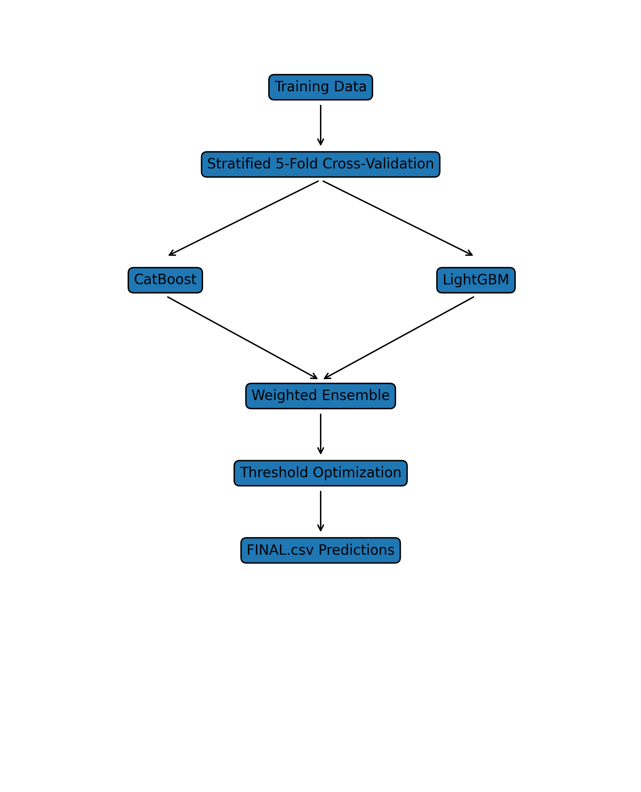

# IEEE ML Challenge — Fault Detection System  
 

## OVERVIEW

This repository contains our team’s solution for the **IEEE SB GEHU Machine Learning Challenge**.

The objective of the challenge is to detect faulty device states using telemetry data collected from an embedded monitoring system.

The problem is formulated as a binary classification task:

- **0 — Normal Operation**
- **1 — Fault Condition**

Our approach focuses on building a robust and reliable model that generalizes well to unseen data using ensemble learning and a carefully designed validation strategy.

 

## DATASET

The dataset consists of 47 numerical features (F01–F47) representing operational parameters recorded during device activity cycles.

Each sample corresponds to a snapshot of the device’s state.

**Key Characteristics:**

- All features are numeric  
- Target variable: `Class`  
- Binary labels: Normal (0) or Faulty (1)  
- Evaluation metric: F1 Score  

The dataset provided by the organizers was used directly for training and evaluation. No external data sources were used.

 

## METHODOLOGY

### a. Model Architecture

We implemented an ensemble of two gradient boosting algorithms:

- **CatBoost Classifier**
- **LightGBM Classifier**

These models are particularly effective for structured tabular datasets and are capable of capturing complex nonlinear relationships between features.

Final predictions are obtained using weighted averaging of model probabilities:

Final Probability = 0.6 × CatBoost + 0.4 × LightGBM

### b. Validation Strategy

To ensure reliable performance estimation and minimize overfitting, we used:

- Stratified 5-Fold Cross-Validation  
- Out-of-Fold (OOF) Predictions  
- Threshold tuning based on validation performance  

The classification threshold was selected by maximizing the F1 Score on OOF predictions.

### c. Feature Analysis

Basic exploratory analysis was performed to understand feature behavior and class distribution.

Since all features represent numerical sensor readings, gradient boosting models were selected because they require minimal preprocessing and perform strongly on tabular data.

Feature importance analysis from both CatBoost and LightGBM was examined to ensure that multiple features contributed meaningfully to the final predictions rather than relying on a single dominant variable.

 

## PIPELINE OVERVIEW

Below is the workflow followed in our solution:

The pipeline follows these steps:

1. Load training and test datasets  
2. Apply Stratified 5-Fold Cross-Validation  
3. Train CatBoost and LightGBM models  
4. Combine predictions using weighted ensemble  
5. Optimize classification threshold  
6. Generate FINAL.csv for submission  

 

## RESULTS

- Out-of-Fold F1 Score: **0.9867**
- Consistent performance across folds
- Minimal gap between training and validation scores

These results indicate strong generalization capability on unseen data.

 

## REPRODUCIBILITY

Clone the repository:

git clone https://github.com/Mohitkaintura123/gehu-ml-challenge-fault-detection

cd gehu-ml-challenge-fault-detection

Install dependencies:

pip install -r requirements.txt

Run the training script:

python train.py

 

## OUTPUT

The script generates a file named **FINAL.csv** containing predictions for the test dataset.

**Format:**

ID,CLASS

- The file contains exactly **10944 rows**
- `ID` values are ordered exactly as in TEST.csv
- `CLASS` contains model predictions (0 or 1)

 

## TECHNOLOGIES USED

- Python  
- CatBoost  
- LightGBM  
- Scikit-learn  
- Pandas  
- NumPy  

 

## ORIGINALITY STATEMENT

All code, experiments, and methodology in this repository were developed by our team specifically for this challenge.

 

## Notes

- The solution is optimized for CPU execution and does not require GPU acceleration.
- Random seeds were fixed during training to ensure reproducibility.
- Only the latest code file is included for evaluation clarity.
